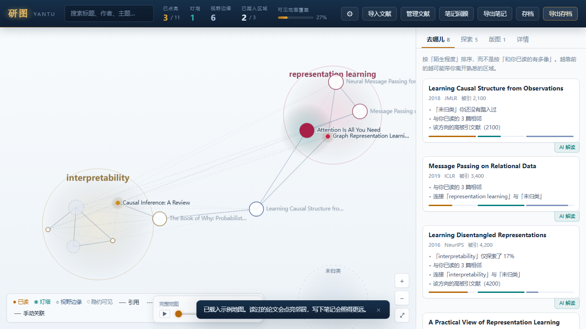
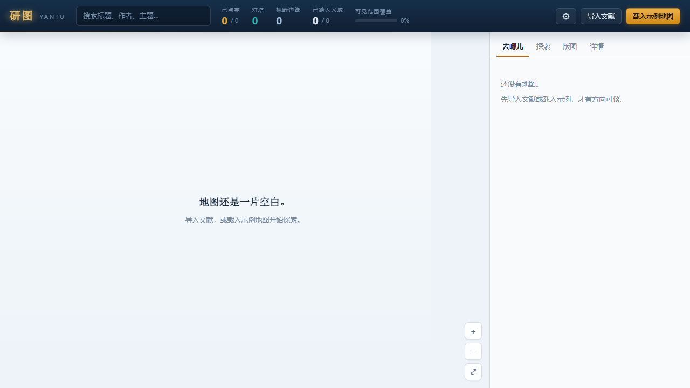
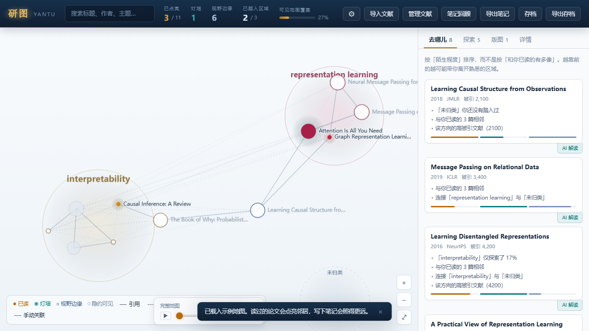
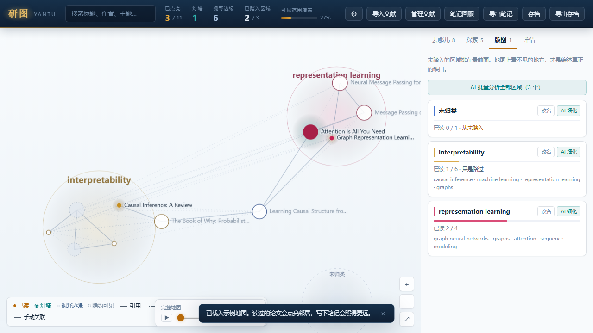
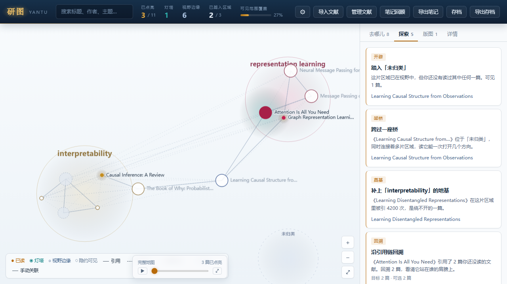
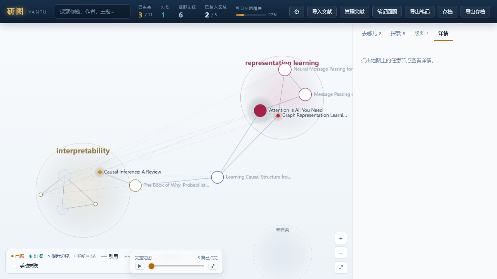
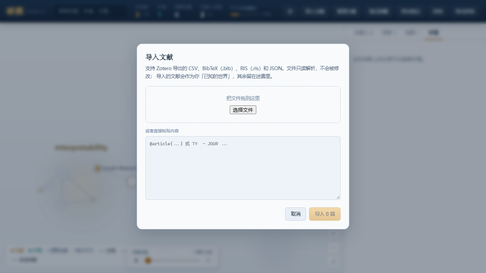
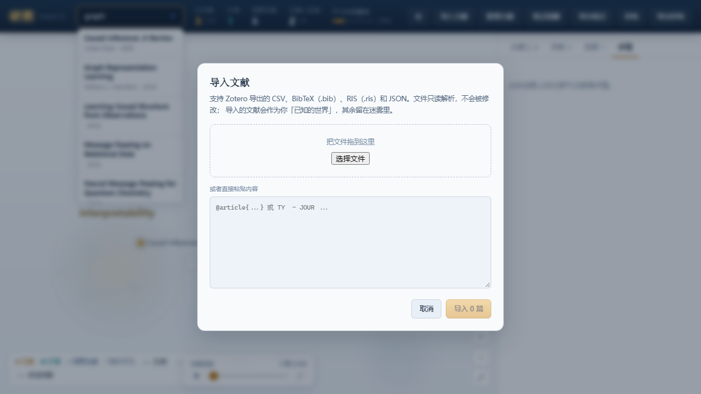
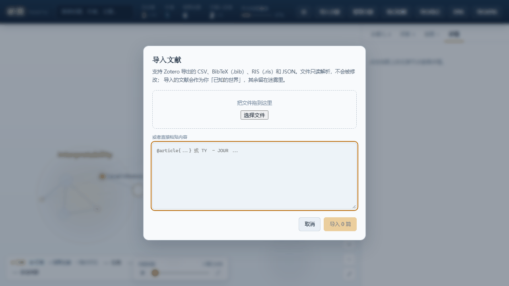

# 研图 Yantu

*把你正在研究的领域，做成一张待探索的地图*



**版本** v0.1 · **日期** 2026-09-14 · **形态** Tauri 桌面端 / Web Demo

*唯一的奖励，是更大的地图。*

---

## 目录

- [这是什么](#这是什么)
- [核心循环](#核心循环)
- [与传统工具的区别](#与传统工具的区别)
- [界面导览](#界面导览)
- [功能详解](#功能详解)
- [如何使用](#如何使用)
- [适用场景](#适用场景)
- [隐私与数据](#隐私与数据)
- [技术概览](#技术概览)
- [快速上手](#快速上手)

---

## 这是什么

**研图 Yantu** 是一款游戏化学术探索工具。

读过的论文会**发光**，光照到的地方浮现邻接文献，没照到的地方留在**迷雾**里。研究的动作本身，就是推开迷雾的动作。

> 研究者真正卡住的地方，往往不是「我已经读过的文献之间有什么关系」，而是：
>
> **我没在看什么？我的盲区长什么样？**

传统文献工具——Zotero 列表、全量引用图谱、推荐算法——都在回答第一个问题。它们把用户已有的文库全部画出来，于是**缺失的东西没有行，也没有节点**，盲区在界面上根本不存在。

Yantu 反其道而行：**默认隐藏未知**，让「看不见」成为界面上一个可见、可操作的状态。

| 维度 | 说明 |
|:-----|:-----|
| **平台** | Tauri 2 跨平台桌面端（Windows / macOS / Linux），支持 Web 开发模式 |
| **数据** | 本地优先，支持 Zotero / BibTeX / RIS / CSV / JSON 导入 |
| **联网** | 可选 OpenAlex 扩展，仅发送用户主动请求的单条标识符 |
| **交互** | Canvas 地图 + 迷雾机制 + 线索推荐 + 区域版图 + 探索任务 |

---

## 核心循环

```
读一篇  →  它点亮  →  照见邻接的陌生文献  →  其中有你没想到的方向  →  读一篇
                ↑                                                      │
                └──────────  写下笔记，照得更远一跳  ←──────────────────┘
```

**刻意去除的元素：**

- ❌ 没有分数、等级、连续登录天数
- ❌ 没有「完成任务领奖励」的外驱激励
- ❌ 没有按相似度排序的推荐信息流

**保留的唯一正反馈：** 地图变大了——因为你真的多知道了一些东西。

### 三条设计公理

| 公理 | 含义 | 产品体现 |
|:-----|:-----|:---------|
| **诚实** | 不替用户假装知道 | 导入的文献永远可见；迷雾只用于线上未知文献 |
| **反茧房** | 推荐应拓宽视野，而非加固偏见 | 线索排序刻意压低「和你已读有多像」的权重 |
| **思考有价** | 点击不应等价于理解 | 笔记是唯一的视野增益——写想法，才多照一跳 |

---

## 与传统工具的区别

```
传统图谱：  [已读 A] ── [已读 B] ── [已读 C]     →  回答「我知道什么」
研图 Yantu：[已读 A] ··· 迷雾 ··· ? ? ?          →  回答「我还不知道什么」
                      ↓ 点亮
              [已读 A] ── [未读 D] ── ? ?          →  邻接文献浮现
```

| 维度 | Zotero / 列表 | 全量引用图谱 | 推荐算法 | **Yantu** |
|:-----|:-------------|:------------|:--------|:----------|
| 核心问题 | 我有什么 | 已知之间什么关系 | 下一步读什么 | **我不知道什么** |
| 未知文献 | 不在列表中 | 全部显示 | 按相似度推 | **迷雾隐藏，点亮才现** |
| 推荐逻辑 | 无 | 无 | 相似度优先 | **陌生度 + 桥梁性优先** |
| 思考激励 | 无 | 无 | 无 | **笔记 = 更远视野** |
| 数据位置 | 本地 | 本地/云 | 通常需上传行为 | **本地优先** |

---

## 界面导览

### 首次启动

打开应用后，点击右上角 **「载入示例地图」**，即可用五个方向的真实论文数据立刻看到完整机制。



### 示例地图全貌

示例地图自带 3 篇已读、1 篇灯塔（有笔记）。第一帧就能看到完整的视觉词汇——**发光、灯塔、前沿、迷雾**。


**HUD 状态栏解读：**

| 指标 | 示例值 | 含义 |
|:-----|:------|:-----|
| 已点亮 | 3 / 11 | 已读论文占文库比例 |
| 灯塔 | 1 | 写了笔记的论文（照得更远） |
| 视野边缘 | 6 | 可达但未读的前沿文献 |
| 已踏入区域 | 2 / 3 | 探索过的研究区域 |
| 可见范围覆盖 | 27% | 迷雾被推开后的覆盖度 |

**视觉语言：**

| 元素 | 颜色 / 形态 | 含义 |
|:-----|:-----------|:-----|
| 暖色实心 + 光晕 | 🟠 琥珀 | 已读 |
| 冷色实心 + 呼吸光晕 | 🟢 青色 | 灯塔（已读 + 有笔记） |
| 实线空心圈 | ⭕ | 前沿（可达、未读） |
| 虚线空心圈 | ◌ | 隐约可见（知道有东西，不知是什么） |
| 不绘制 | — | 迷雾（完全未知） |

---

## 功能详解

### 1. 迷雾与可见度

迷雾不是加载状态，而是**认知边界的可视化**。光沿强边传播（引用、真实主题重叠），每读一篇，邻接文献从迷雾边缘浮现。


---

### 2. 反推荐线索 · 「去哪儿」

普通推荐按「和你已读有多像」排序——那正是研究者需要逃离的信息茧房。

**Yantu 的排序公式：**

```
分数 = 0.45 × 陌生度 + 0.30 × 桥梁性 + 0.25 × 可达性
```

> **最好的线索，是可达但在别处的文献。**

每条线索必须给出人话理由，例如：

- 「『因果推断』你还没有踏入过」
- 「连接『图神经网络』与『可解释性』」
- 「邻接 3 篇你已读过的论文」



---

### 3. 区域版图 · 「版图」

区域用可解释的关键词划分，保证稳定且可叙事。界面能说出 **「『强化学习』你从未踏入过」**——一个有名字的空地，才做得到。



| 特性 | 说明 |
|:-----|:-----|
| **可解释** | 区域名来自语料，用户能复述 |
| **稳定** | 同一份语料永远产出同一批区域 |
| **可叙事** | beckoning 区域高亮提示待探索方向 |

---

### 4. 探索任务 · 「探索」

探索目标完全由当前地图**实时推导**，不持久化任何任务进度。

- 无法过期、无法被刷、不需要数据迁移
- 局面变了，任务自己消失
- 唯一奖励仍是：**更大的地图**



---

### 5. 论文详情 · 「详情」

点击地图节点打开详情面板。标记已读、写笔记升灯塔、查看引用关系——**每个动作都直接改变地图形状**。



- **标记已读** → 暖色发光，邻接文献浮现
- **写笔记** → 升级为灯塔，比普通已读多照一跳
- **AI 解读** → 可选辅助理解（需配置 API）
- **联网扩展** → 可选 OpenAlex，仅发送单条标识符

---

### 6. 多格式导入

支持 Zotero CSV、BibTeX（`.bib`）、RIS（`.ris`）、CSL-JSON / Zotero JSON。

导入前显示预览：识别多少条、重复多少、跳过哪些以及为什么。**原文件只读，不会被修改。**



同一篇论文以不同标识符到达（DOI / OpenAlex id / arXiv id）会**自动归并**成一个节点，读进度和笔记跟着迁移，不会丢。

---

### 7. 语义搜索

在已点亮的地图范围内搜索标题、作者、主题——迷雾中的未知不会被误搜到。



---

## 如何使用

### 八步完整流程

#### Step 1 · 载入示例地图


#### Step 2 · 观察地图，理解可见度


#### Step 3 · 查看线索，选一条陌生但可达的路


#### Step 4 · 点击论文，标记已读，推开迷雾



#### Step 5 · 写笔记，升级为灯塔

在详情面板写下想法。笔记是唯一的视野增益——`read → beacon` 必须写笔记。

#### Step 6 · 检查版图，发现空白区域


#### Step 7 · 接受探索任务


#### Step 8 · 导入自己的文库（可选）


---

## 适用场景

### 研究生 · 发现文献盲区

> 导入 Zotero 800 篇，标记精读后打开版图——「原来我的研究版图长这样」。

1. 导入 Zotero 文库（全部可见，无迷雾）
2. 标记真正精读过的一小部分
3. 打开「版图」面板 —— 看到哪些区域从未踏入
4. 点击空白区域，获取跨域线索

---

### 知乎答主 · 写领域入门长文

> 从「线性书单」升级为「探索路径可视化」——读者看到的是可复现的认知过程。

1. 导入该领域 20–50 篇核心论文
2. 标记 3–5 篇已读，观察地图如何点亮
3. 查看「去哪儿」面板的线索理由
4. 沿线索拓展 2–3 个新方向
5. 导出地图截图 + 笔记，形成「我是这样走进来的」叙事

---

### 跨领域学习者 · 建立全局感

> 适合「一张图看懂 XX 与 YY 的关系」类高收藏内容。

1. 载入示例地图（五个方向的真实论文数据）
2. 不追求读完，先观察区域之间的连接
3. 选一条「桥梁线索」，读连接两个区域的论文
4. 写笔记，看光如何向第三区域扩散

---

### 文献综述 · 结构自检

> 写综述前不确定自己的阅读是否覆盖了主要脉络。

1. 导入综述涉及的所有论文
2. 按真实阅读进度标记
3. 检查区域覆盖度与线索面板中的「高陌生度」节点
4. 针对性补读，地图实时反映结构完整性

---

## 隐私与数据

| 原则 | 实现 |
|:-----|:-----|
| **本地优先** | 存档存于本机，可导出纯 JSON 随时带走 |
| **最小联网** | 仅用户点击「联网扩展」时发送单条标识符 |
| **不上传文库** | CSP 限制 `connect-src` 为 `api.openalex.org` |
| **只读导入** | 解析导出文件，不修改原文件 |
| **透明归并** | 导入预览展示识别数、重复数、跳过原因 |

探索过程默认私密，公开与否由用户决定。

---

## 技术概览

### 架构

```
┌─────────────────────────────────────────────────────────────┐
│                     React 18 + TypeScript                    │
│  MapCanvas │ LeadsPanel │ RegionsPanel │ Import │ Settings  │
└────────────────────────────┬────────────────────────────────┘
                             │ Zustand Store
┌────────────────────────────▼────────────────────────────────┐
│  SaveState 持久化  ←→  buildWorld() 纯函数推导  →  WorldView │
└────────────────────────────┬────────────────────────────────┘
                             │
┌────────────────────────────▼────────────────────────────────┐
│  game/  reconcile → edges → regions → fog → leads → world   │
└────────────────────────────┬────────────────────────────────┘
                             │
┌────────────────────────────▼────────────────────────────────┐
│  render/  layout（可分步力导） │ palette │ draw               │
└────────────────────────────┬────────────────────────────────┘
                             │
┌────────────────────────────▼────────────────────────────────┐
│                      Tauri 2 + Rust                          │
└─────────────────────────────────────────────────────────────┘
```

### 核心设计：「存的少，推的多」

```
SaveState（持久化）              WorldView（每次推导）
├── papers                       ├── edges       关系
├── progress  已读 + 笔记      →  ├── regions     区域
├── manualEdges                  ├── visibility  迷雾
└── regionNames                  ├── leads       线索
                                 ├── quests      探索任务
                                 └── stats       统计
```

| 收益 | 说明 |
|:-----|:-----|
| 无同步问题 | 派生状态不可能和存档不一致 |
| 规则可演进 | 改评分/迷雾规则对老存档立即生效，无需迁移 |
| 损坏隔离 | 部分写入只影响某个字段，不会拖垮整个文库 |
| 可测试 | `buildWorld()` 是纯函数，同样输入永远同样输出 |

### 性能指标

| 指标 | 实测（1000 篇 / ~19.5k 边） |
|:-----|:---------------------------|
| `buildWorld` | ~95ms（仅在存档变化时） |
| 力导布局收敛 | ~2s（可分步推进，不卡 UI） |
| 地图交互帧率 | ≥ 30fps（1000 节点） |

### 技术栈

| 层级 | 选型 |
|:-----|:-----|
| 桌面壳 | Tauri 2 |
| 前端 | React 18 + TypeScript + Vite |
| 状态 | Zustand 5 |
| 地图 | 原生 Canvas 2D |
| 测试 | Vitest |
| 外部数据 | OpenAlex API |

---

## 快速上手

```bash
# 安装依赖
npm install

# Web 开发模式（浏览器打开 localhost:5173）
npm run dev:web

# Tauri 桌面端
npm run dev

# 构建桌面安装包
npm run build:tauri
```

**首次启动：** 点击「载入示例地图」，2 分钟内看到完整机制；或直接导入自己的 Zotero 文库。

### 预览产品展示站

```bash
python -m http.server 8000 -d showcase
# 打开 http://localhost:8000
```

---

**研图 Yantu**

把你正在研究的领域，做成一张待探索的地图。

*唯一的奖励，是更大的地图。*

相关文档：[完整计划书](产品说明计划书.md) · [设计说明](design.md) · [在线展示站](../showcase/index.html)
